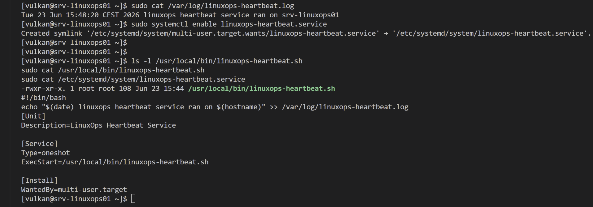
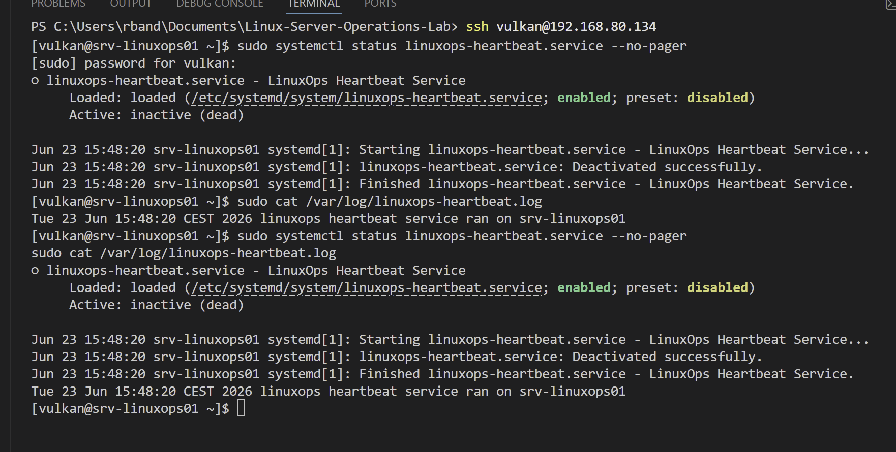
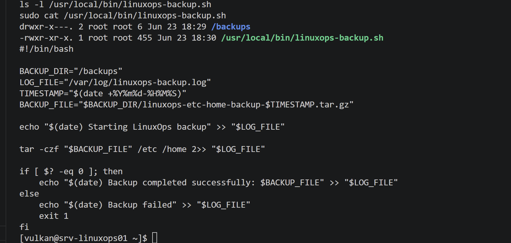
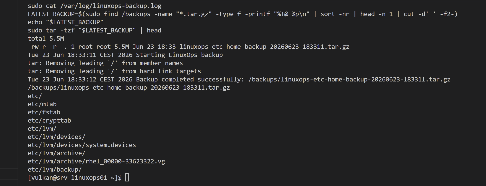
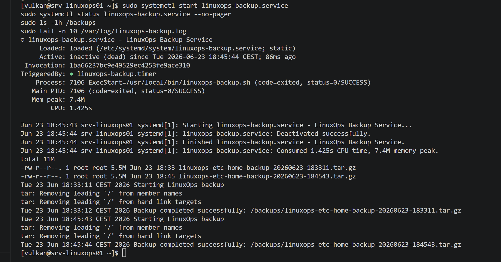
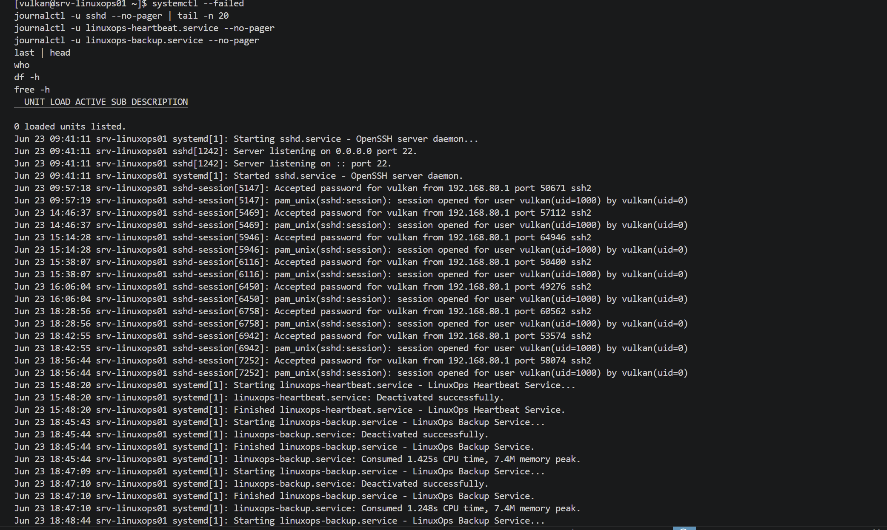
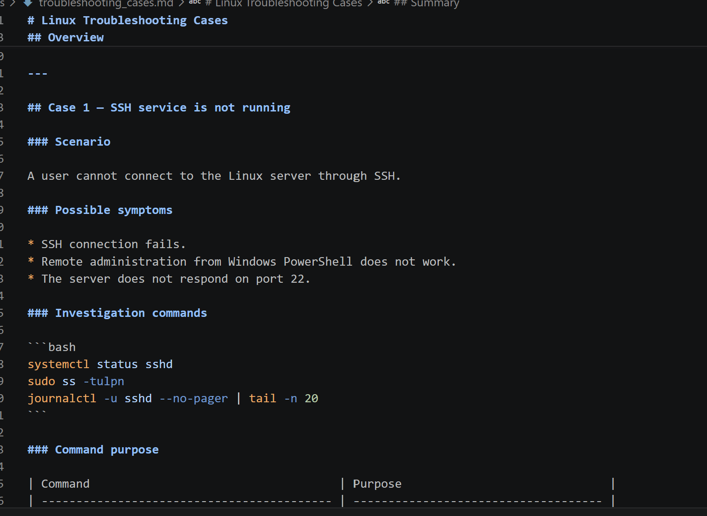
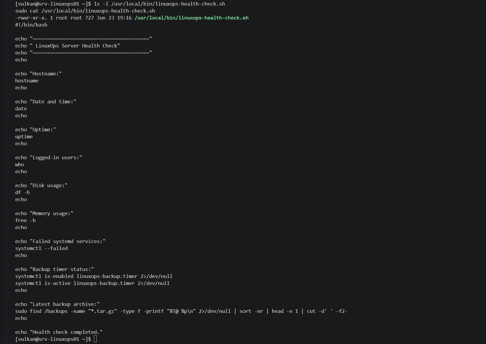
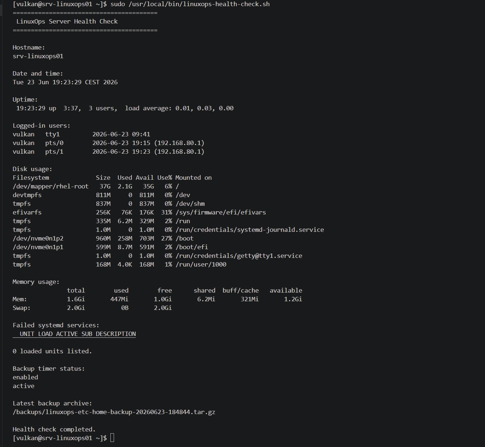

# Linux Server Operations Lab — Logbook

## 2026-06-23 — Part 1: Repository setup and planning

### Goal

Start the Linux Server Operations Lab by creating the local project structure, initial documentation files and Git repository.

### Work completed

* Created the local project folder.
* Created the main documentation folders:

  * docs
  * screenshots
  * scripts
  * results
  * backups
* Created README.md.
* Created logbook.md.
* Added initial project overview and planned lab parts.
* Prepared the project for the first Git commit.
* Initialized the local Git repository.
* Created the GitHub repository.
* Pushed the first project commit to GitHub.

### Notes

This lab will focus on practical Linux server operations and monitoring tasks.

The project is intended for a sysadmin portfolio and will be documented step by step with screenshots, command outputs and Git commits.

Public documentation will use the name Vulkan.

### Evidence

Screenshots:


---

## 2026-06-23 — Part 2: Linux server VM installation

### Goal

Install and verify the Linux operations server VM for the Linux Server Operations Lab.

### Work completed

* Created a VMware virtual machine named srv-linuxops01.
* Configured the VM with:

  * 2 CPU cores
  * 2048 MB RAM
  * 40 GB virtual disk
  * NAT networking
* Installed Red Hat Enterprise Linux 10.1 using Minimal Install.
* Configured the hostname as srv-linuxops01.
* Created the administrator user vulkan.
* Verified the installed operating system.
* Verified the active network interface and IP address.
* Verified disk usage.
* Verified memory and swap.
* Saved installation verification screenshots.

### Verification results

| Item                 | Result                        |
| -------------------- | ----------------------------- |
| Hostname             | srv-linuxops01                |
| User                 | vulkan                        |
| Operating system     | Red Hat Enterprise Linux 10.1 |
| Network interface    | ens160                        |
| IP address           | 192.168.80.134/24             |
| Root filesystem      | /dev/mapper/rhel-root         |
| Root filesystem size | 37 GB                         |
| Memory               | 1.6 GiB                       |
| Swap                 | 2.0 GiB                       |
| Virtualization       | VMware                        |

### Commands used

```bash
hostnamectl
whoami
cat /etc/os-release
ip addr
df -h
free -h
```

### Command purpose

| Command             | Purpose                                                                       |
| ------------------- | ----------------------------------------------------------------------------- |
| hostnamectl         | Shows the hostname, operating system, kernel and system identity information. |
| whoami              | Shows the currently logged-in user.                                           |
| cat /etc/os-release | Shows the installed Linux distribution and version.                           |
| ip addr             | Shows network interfaces and IP addresses.                                    |
| df -h               | Shows disk usage in human-readable format.                                    |
| free -h             | Shows memory and swap usage in human-readable format.                         |

### Notes

The server was installed using Minimal Install because this is closer to a real Linux server environment. A minimal server uses fewer resources and avoids unnecessary graphical software.

The VM received an IP address through VMware NAT networking. This will be used later when testing SSH administration from the Windows host.

### Evidence

Screenshots:


---

## 2026-06-23 — Part 3: Network and SSH administration

### Goal

Configure and verify SSH administration for the Linux operations server.

### Work completed

* Verified the active Linux network interface.
* Confirmed the server IP address.
* Checked the SSH daemon service.
* Verified that sshd is active and running.
* Verified that SSH is listening on port 22.
* Checked that firewalld is running.
* Verified that the firewall allows SSH traffic.
* Tested SSH login from Windows PowerShell.
* Confirmed remote administration access to srv-linuxops01.

### Verification results

| Item                     | Result            |
| ------------------------ | ----------------- |
| SSH service              | active running    |
| SSH daemon               | sshd              |
| SSH port                 | 22                |
| Firewall service         | firewalld         |
| Firewall state           | running           |
| Allowed firewall service | ssh               |
| Network interface        | ens160            |
| Server IP address        | 192.168.80.134/24 |
| Remote login user        | vulkan            |
| Remote login test        | Successful        |

### Commands used

```bash
systemctl status sshd
sudo firewall-cmd --state
sudo firewall-cmd --list-all
ip addr
```

```powershell
ssh vulkan@192.168.80.134
```

```bash
hostname
whoami
```

### Command purpose

| Command                      | Purpose                                                                   |
| ---------------------------- | ------------------------------------------------------------------------- |
| systemctl status sshd        | Checks whether the SSH server service is running.                         |
| sudo firewall-cmd --state    | Checks whether firewalld is running.                                      |
| sudo firewall-cmd --list-all | Shows active firewall zone settings and allowed services.                 |
| ip addr                      | Shows network interfaces and IP addresses.                                |
| ssh vulkan@192.168.80.134    | Starts a secure remote terminal session from Windows to the Linux server. |
| hostname                     | Confirms the connected system hostname.                                   |
| whoami                       | Confirms the logged-in Linux user.                                        |

### Notes

SSH is required for remote Linux administration. In a real server environment, administrators usually manage Linux systems remotely instead of using the local console.

The firewall allows SSH, which means the server can accept remote administration connections while still keeping firewall protection active.

Successful SSH login from Windows PowerShell confirms that the Linux server can be managed remotely.

### Evidence

Screenshots:


---

## 2026-06-23 — Part 4: Users, groups and sudo access

### Goal

Create Linux users and groups, assign group membership and verify sudo access behavior.

### Work completed

* Created the linuxops group.
* Created the backupops group.
* Created the opsadmin user.
* Created the backupuser user.
* Created the readonlyuser user.
* Set passwords for the created users.
* Added opsadmin to the linuxops group.
* Added backupuser to the backupops group.
* Added opsadmin to the wheel group for sudo access.
* Verified user and group membership.
* Tested sudo access for opsadmin.
* Verified that readonlyuser does not have sudo access.

### Verification results

| Item                          | Result                    |
| ----------------------------- | ------------------------- |
| Operations group              | linuxops                  |
| Backup group                  | backupops                 |
| Admin test user               | opsadmin                  |
| Backup test user              | backupuser                |
| Limited test user             | readonlyuser              |
| opsadmin group membership     | opsadmin, wheel, linuxops |
| backupuser group membership   | backupuser, backupops     |
| readonlyuser group membership | readonlyuser only         |
| opsadmin sudo test            | Successful                |
| readonlyuser sudo test        | Denied as expected        |

### Commands used

```bash
sudo groupadd linuxops
sudo groupadd backupops
sudo useradd -m -s /bin/bash opsadmin
sudo useradd -m -s /bin/bash backupuser
sudo useradd -m -s /bin/bash readonlyuser
sudo passwd opsadmin
sudo passwd backupuser
sudo passwd readonlyuser
sudo usermod -aG linuxops opsadmin
sudo usermod -aG backupops backupuser
sudo usermod -aG wheel opsadmin
id opsadmin
id backupuser
id readonlyuser
getent group linuxops
getent group backupops
su - opsadmin
whoami
sudo whoami
exit
su - readonlyuser
whoami
sudo whoami
```

### Command purpose

| Command                                   | Purpose                                                                 |
| ----------------------------------------- | ----------------------------------------------------------------------- |
| sudo groupadd linuxops                    | Creates the linuxops group.                                             |
| sudo groupadd backupops                   | Creates the backupops group.                                            |
| sudo useradd -m -s /bin/bash opsadmin     | Creates opsadmin with a home directory and Bash shell.                  |
| sudo useradd -m -s /bin/bash backupuser   | Creates backupuser with a home directory and Bash shell.                |
| sudo useradd -m -s /bin/bash readonlyuser | Creates readonlyuser with a home directory and Bash shell.              |
| sudo passwd username                      | Sets a password for the selected user.                                  |
| sudo usermod -aG group user               | Adds an existing user to an additional group.                           |
| id username                               | Shows user ID and group membership.                                     |
| getent group groupname                    | Shows information about a specific group.                               |
| su - username                             | Switches to another user and loads that user environment.               |
| whoami                                    | Shows the currently active user.                                        |
| sudo whoami                               | Tests whether the user can run a command with administrator privileges. |
| exit                                      | Leaves the current user session and returns to the previous session.    |

### Notes

The opsadmin user was added to the wheel group, which allows sudo access on RHEL-based systems.

The readonlyuser account was intentionally left without sudo access. This confirms that limited users cannot perform administrator actions.

This part demonstrates basic Linux identity and access management, including user creation, group membership and privilege testing.

### Evidence

Screenshots:


---

## 2026-06-23 — Part 5: Firewall and basic hardening

### Goal

Verify the Linux firewall configuration and review listening network services for basic hardening.

### Work completed

* Checked the firewalld service status.
* Verified that firewalld is active and running.
* Confirmed that firewalld is enabled at boot.
* Checked the current firewall state.
* Listed the active firewall zone configuration.
* Verified that SSH is allowed through the firewall.
* Reviewed listening TCP and UDP services.
* Confirmed that SSH is the only externally listening remote administration service.
* Confirmed that chronyd is only listening locally for time synchronization.
* Verified that Cockpit is allowed in the firewall but not actively listening on port 9090.

### Verification results

| Item                             | Result                                            |
| -------------------------------- | ------------------------------------------------- |
| Firewall service                 | firewalld                                         |
| Firewall status                  | active running                                    |
| Firewall boot state              | enabled                                           |
| Firewall state                   | running                                           |
| Active zone                      | public                                            |
| Active interface                 | ens160                                            |
| Allowed services                 | cockpit, dhcpv6-client, ssh                       |
| Externally listening TCP service | sshd on port 22                                   |
| Local UDP service                | chronyd on port 323                               |
| Cockpit listening on port 9090   | No                                                |
| Hardening result                 | No unexpected externally listening services found |

### Commands used

```bash
sudo systemctl status firewalld
sudo firewall-cmd --state
sudo firewall-cmd --list-all
sudo ss -tulpn
```

### Command purpose

| Command                         | Purpose                                                                                                          |
| ------------------------------- | ---------------------------------------------------------------------------------------------------------------- |
| sudo systemctl status firewalld | Checks whether the firewall service is running and enabled.                                                      |
| sudo firewall-cmd --state       | Shows whether firewalld is currently running.                                                                    |
| sudo firewall-cmd --list-all    | Lists the active firewall zone, interface and allowed services.                                                  |
| sudo ss -tulpn                  | Shows TCP and UDP services that are listening for network connections, including process names and port numbers. |

### Notes

The firewall is active and allows SSH, which is required for remote administration.

The firewall also lists Cockpit as an allowed service, but the listening services check did not show Cockpit listening on port 9090. This means Cockpit was allowed by the firewall but was not actively exposed as a running web administration service.

The listening services check showed sshd listening on port 22 and chronyd listening locally on port 323. No unexpected externally listening services were found.

This part demonstrates basic Linux firewall review and service exposure checking.

### Evidence

Screenshots:


---

## 2026-06-23 — Part 6: Systemd service management

### Goal

Create and verify a custom systemd service that runs a Linux script and writes a heartbeat message to a log file.

### Work completed

* Attempted to use nano to create the script file.
* Confirmed nano was not installed on the RHEL Minimal Install system.
* Attempted to install nano with dnf.
* Confirmed that the RHEL system was not registered and had no enabled repositories.
* Created the heartbeat script using tee instead of nano.
* Created the script at /usr/local/bin/linuxops-heartbeat.sh.
* Made the script executable.
* Verified the script permissions.
* Created the custom systemd service file at /etc/systemd/system/linuxops-heartbeat.service.
* Reloaded systemd daemon configuration.
* Started the custom systemd service.
* Verified the service status.
* Confirmed that the oneshot service completed successfully.
* Verified that the heartbeat log file was created and updated.
* Enabled the custom service for the multi-user target.

### Verification results

| Item                 | Result                                         |
| -------------------- | ---------------------------------------------- |
| Script path          | /usr/local/bin/linuxops-heartbeat.sh           |
| Script permission    | executable                                     |
| Script owner         | root                                           |
| Service name         | linuxops-heartbeat.service                     |
| Service file path    | /etc/systemd/system/linuxops-heartbeat.service |
| Service type         | oneshot                                        |
| Service enabled      | Yes                                            |
| Service active state | inactive dead after successful run             |
| Service result       | Deactivated successfully                       |
| Log file             | /var/log/linuxops-heartbeat.log                |
| Log result           | Heartbeat entry written successfully           |

### Commands used

```bash
sudo nano /usr/local/bin/linuxops-heartbeat.sh
sudo dnf install -y nano
sudo tee /usr/local/bin/linuxops-heartbeat.sh > /dev/null <<'EOF'
#!/bin/bash
echo "$(date) linuxops heartbeat service ran on $(hostname)" >> /var/log/linuxops-heartbeat.log
EOF
sudo chmod +x /usr/local/bin/linuxops-heartbeat.sh
ls -l /usr/local/bin/linuxops-heartbeat.sh
sudo /usr/local/bin/linuxops-heartbeat.sh
sudo cat /var/log/linuxops-heartbeat.log
sudo tee /etc/systemd/system/linuxops-heartbeat.service > /dev/null <<'EOF'
[Unit]
Description=LinuxOps Heartbeat Service

[Service]
Type=oneshot
ExecStart=/usr/local/bin/linuxops-heartbeat.sh

[Install]
WantedBy=multi-user.target
EOF
sudo systemctl daemon-reload
sudo systemctl start linuxops-heartbeat.service
sudo systemctl status linuxops-heartbeat.service --no-pager
sudo cat /var/log/linuxops-heartbeat.log
sudo systemctl enable linuxops-heartbeat.service
sudo cat /usr/local/bin/linuxops-heartbeat.sh
sudo cat /etc/systemd/system/linuxops-heartbeat.service
```

### Command purpose

| Command                                                     | Purpose                                                               |
| ----------------------------------------------------------- | --------------------------------------------------------------------- |
| sudo nano /usr/local/bin/linuxops-heartbeat.sh              | Attempts to open nano to create the heartbeat script.                 |
| sudo dnf install -y nano                                    | Attempts to install nano using the RHEL package manager.              |
| sudo tee /usr/local/bin/linuxops-heartbeat.sh               | Creates the heartbeat script without using a text editor.             |
| sudo chmod +x /usr/local/bin/linuxops-heartbeat.sh          | Makes the script executable.                                          |
| ls -l /usr/local/bin/linuxops-heartbeat.sh                  | Shows the script file permissions, owner and path.                    |
| sudo /usr/local/bin/linuxops-heartbeat.sh                   | Runs the script manually for testing.                                 |
| sudo cat /var/log/linuxops-heartbeat.log                    | Displays the heartbeat log file.                                      |
| sudo tee /etc/systemd/system/linuxops-heartbeat.service     | Creates the custom systemd service file.                              |
| sudo systemctl daemon-reload                                | Reloads systemd so it detects the new service file.                   |
| sudo systemctl start linuxops-heartbeat.service             | Starts the custom service once.                                       |
| sudo systemctl status linuxops-heartbeat.service --no-pager | Shows the service status without opening a pager view.                |
| sudo systemctl enable linuxops-heartbeat.service            | Enables the service for the multi-user target.                        |
| sudo cat /usr/local/bin/linuxops-heartbeat.sh               | Displays the script content for documentation evidence.               |
| sudo cat /etc/systemd/system/linuxops-heartbeat.service     | Displays the systemd service file content for documentation evidence. |

### Notes

The RHEL Minimal Install system did not include nano by default. Installing nano with dnf failed because the system was not registered with Red Hat subscription management and had no enabled package repositories.

Instead of using nano, the script and systemd service file were created with tee and here-document syntax. This is useful in minimal server environments where a text editor or package repositories may not be available.

The service uses Type=oneshot, which means it runs once and then exits. Because of this, inactive dead is normal after the service finishes, as long as the service completed successfully and the log file was updated.

This part demonstrates custom script creation, systemd unit file creation, service management and log verification.

### Evidence

Screenshots:





---

## 2026-06-23 — Part 7: Backup script

### Goal

Create and verify a Linux backup script that generates compressed backup archives and logs backup activity.

### Work completed

* Created the /backups directory.
* Set restricted permissions on the /backups directory.
* Created a backup script at /usr/local/bin/linuxops-backup.sh.
* Configured the script to back up /etc and /home.
* Configured the script to create timestamped .tar.gz archives.
* Configured the script to write activity to /var/log/linuxops-backup.log.
* Made the backup script executable.
* Verified the backup script permissions and content.
* Ran the backup script manually.
* Verified that a compressed backup archive was created.
* Verified that the backup log recorded a successful backup.
* Tested the backup archive by listing its contents with tar.

### Verification results

| Item                         | Result                               |
| ---------------------------- | ------------------------------------ |
| Backup directory             | /backups                             |
| Backup directory permissions | 750                                  |
| Backup script path           | /usr/local/bin/linuxops-backup.sh    |
| Backup script permission     | executable                           |
| Backup script owner          | root                                 |
| Backup targets               | /etc and /home                       |
| Backup format                | .tar.gz                              |
| Backup log file              | /var/log/linuxops-backup.log         |
| Backup archive created       | Yes                                  |
| Backup archive size          | 5.5 MB                               |
| Backup test                  | Archive contents listed successfully |
| Backup result                | Successful                           |

### Commands used

```bash
sudo mkdir -p /backups
sudo chmod 750 /backups
ls -ld /backups
sudo tee /usr/local/bin/linuxops-backup.sh > /dev/null <<'EOF'
#!/bin/bash

BACKUP_DIR="/backups"
LOG_FILE="/var/log/linuxops-backup.log"
TIMESTAMP="$(date +%Y%m%d-%H%M%S)"
BACKUP_FILE="$BACKUP_DIR/linuxops-etc-home-backup-$TIMESTAMP.tar.gz"

echo "$(date) Starting LinuxOps backup" >> "$LOG_FILE"

tar -czf "$BACKUP_FILE" /etc /home 2>> "$LOG_FILE"

if [ $? -eq 0 ]; then
    echo "$(date) Backup completed successfully: $BACKUP_FILE" >> "$LOG_FILE"
else
    echo "$(date) Backup failed" >> "$LOG_FILE"
    exit 1
fi
EOF
sudo chmod +x /usr/local/bin/linuxops-backup.sh
ls -l /usr/local/bin/linuxops-backup.sh
sudo cat /usr/local/bin/linuxops-backup.sh
sudo /usr/local/bin/linuxops-backup.sh
sudo ls -lh /backups
sudo cat /var/log/linuxops-backup.log
LATEST_BACKUP=$(sudo find /backups -name "*.tar.gz" -type f -printf "%T@ %p\n" | sort -nr | head -n 1 | cut -d' ' -f2-)
echo "$LATEST_BACKUP"
sudo tar -tzf "$LATEST_BACKUP" | head
```

### Command purpose

| Command                                         | Purpose                                                                |
| ----------------------------------------------- | ---------------------------------------------------------------------- |
| sudo mkdir -p /backups                          | Creates the backup directory if it does not already exist.             |
| sudo chmod 750 /backups                         | Sets restricted permissions on the backup directory.                   |
| ls -ld /backups                                 | Shows the backup directory permissions and ownership.                  |
| sudo tee /usr/local/bin/linuxops-backup.sh      | Creates the backup script without using a text editor.                 |
| sudo chmod +x /usr/local/bin/linuxops-backup.sh | Makes the backup script executable.                                    |
| ls -l /usr/local/bin/linuxops-backup.sh         | Shows the backup script permissions, owner and path.                   |
| sudo cat /usr/local/bin/linuxops-backup.sh      | Displays the backup script content for documentation evidence.         |
| sudo /usr/local/bin/linuxops-backup.sh          | Runs the backup script manually.                                       |
| sudo ls -lh /backups                            | Lists backup archive files in human-readable format.                   |
| sudo cat /var/log/linuxops-backup.log           | Displays the backup log file.                                          |
| sudo find /backups -name "*.tar.gz"             | Finds backup archive files using administrator permissions.            |
| sort -nr                                        | Sorts backup files by newest timestamp first.                          |
| head -n 1                                       | Selects the newest backup archive.                                     |
| cut -d' ' -f2-                                  | Removes the timestamp prefix and keeps only the file path.             |
| echo "$LATEST_BACKUP"                           | Shows the selected backup archive path.                                |
| sudo tar -tzf "$LATEST_BACKUP" \| head         | Lists the first files inside the backup archive without extracting it. |

### Notes

The backup script creates timestamped compressed archives in /backups and records backup activity in /var/log/linuxops-backup.log.

The backup targets are /etc and /home because they represent important system configuration files and user home directories in a Linux environment.

The first attempt to select the latest archive with a wildcard failed because the /backups directory has restricted permissions. The wildcard was expanded by the user shell before sudo could access the directory. This was corrected by using sudo find to locate the newest archive.

The tar messages about removing leading slashes are normal. This makes the archive safer to restore because it avoids storing absolute paths in a way that could overwrite system files unexpectedly.

This part demonstrates backup scripting, archive creation, backup logging and backup verification.

### Evidence

Screenshots:





---

## 2026-06-23 — Part 8: Scheduled backup job

### Goal

Create and verify an automatic scheduled backup job using a systemd timer.

### Work completed

* Created a systemd backup service at /etc/systemd/system/linuxops-backup.service.
* Configured the service to run /usr/local/bin/linuxops-backup.sh.
* Created a systemd backup timer at /etc/systemd/system/linuxops-backup.timer.
* Configured the timer to run the backup service every day at 02:00.
* Enabled and started the backup timer.
* Verified that the timer is active and waiting.
* Listed the active timer with systemctl list-timers.
* Displayed the service and timer configuration for documentation.
* Manually started the backup service through systemd.
* Verified that the backup service completed successfully.
* Verified that backup archives exist in /backups.
* Verified that the backup log was updated after the service run.

### Verification results

| Item                   | Result                            |
| ---------------------- | --------------------------------- |
| Backup service         | linuxops-backup.service           |
| Backup timer           | linuxops-backup.timer             |
| Service type           | oneshot                           |
| Backup script          | /usr/local/bin/linuxops-backup.sh |
| Timer schedule         | Daily at 02:00                    |
| Persistent timer       | Yes                               |
| Timer state            | active waiting                    |
| Timer enabled          | Yes                               |
| Manual service test    | Successful                        |
| Backup archive created | Yes                               |
| Backup log updated     | Yes                               |

### Commands used

```bash
sudo tee /etc/systemd/system/linuxops-backup.service > /dev/null <<'EOF'
[Unit]
Description=LinuxOps Backup Service

[Service]
Type=oneshot
ExecStart=/usr/local/bin/linuxops-backup.sh
EOF

sudo tee /etc/systemd/system/linuxops-backup.timer > /dev/null <<'EOF'
[Unit]
Description=Run LinuxOps Backup Service every day

[Timer]
OnCalendar=*-*-* 02:00:00
Persistent=true
Unit=linuxops-backup.service

[Install]
WantedBy=timers.target
EOF

sudo systemctl daemon-reload
sudo systemctl enable --now linuxops-backup.timer
sudo systemctl status linuxops-backup.timer --no-pager
systemctl list-timers --all | grep linuxops
sudo cat /etc/systemd/system/linuxops-backup.service
sudo cat /etc/systemd/system/linuxops-backup.timer
sudo systemctl start linuxops-backup.service
sudo systemctl status linuxops-backup.service --no-pager
sudo ls -lh /backups
sudo tail -n 10 /var/log/linuxops-backup.log
```

### Command purpose

| Command                                                  | Purpose                                                         |
| -------------------------------------------------------- | --------------------------------------------------------------- |
| sudo tee /etc/systemd/system/linuxops-backup.service     | Creates the systemd service that runs the backup script.        |
| sudo tee /etc/systemd/system/linuxops-backup.timer       | Creates the systemd timer that schedules the backup service.    |
| sudo systemctl daemon-reload                             | Reloads systemd so it detects the new service and timer files.  |
| sudo systemctl enable --now linuxops-backup.timer        | Enables the timer at boot and starts it immediately.            |
| sudo systemctl status linuxops-backup.timer --no-pager   | Shows whether the backup timer is active and waiting.           |
| systemctl list-timers --all \| grep linuxops | Lists systemd timers and filters for the LinuxOps backup timer. |
| sudo cat /etc/systemd/system/linuxops-backup.service     | Displays the backup service file for documentation evidence.    |
| sudo cat /etc/systemd/system/linuxops-backup.timer       | Displays the backup timer file for documentation evidence.      |
| sudo systemctl start linuxops-backup.service             | Manually starts the backup service for testing.                 |
| sudo systemctl status linuxops-backup.service --no-pager | Shows whether the backup service completed successfully.        |
| sudo ls -lh /backups                                     | Lists backup archives in human-readable format.                 |
| sudo tail -n 10 /var/log/linuxops-backup.log             | Shows the latest backup log entries.                            |

### Notes

A systemd timer was used instead of cron because this lab is based on a RHEL-style system and already includes systemd service management.

The timer is configured to run every day at 02:00. The Persistent=true setting means that if the server is powered off at the scheduled time, systemd can run the missed job after the server starts again.

The backup service was also tested manually with systemctl start to confirm that the scheduled job has a working service behind it.

This part demonstrates automatic job scheduling, systemd timers, service-triggered backups and backup verification.

### Evidence

Screenshots:




---

## 2026-06-23 — Part 9: Log review and troubleshooting

### Goal

Review Linux system logs, service logs and system health information, then create a troubleshooting document with realistic Linux support cases.

### Work completed

* Reviewed failed systemd services.
* Checked recent system log activity.
* Reviewed SSH service logs.
* Reviewed custom heartbeat service logs.
* Reviewed backup service logs.
* Checked recent login history.
* Checked currently logged-in users.
* Checked disk usage.
* Checked memory and swap usage.
* Created a troubleshooting document at docs/troubleshooting_cases.md.
* Documented common Linux troubleshooting cases.
* Added investigation commands, command purposes and possible fixes.
* Added extra explanations for services, logs, firewalls, permissions, timers and backup issues.
* Reviewed the troubleshooting document and corrected Markdown table formatting for commands that use pipes.

### Verification results

| Item | Result |
|---|---|
| Failed services checked | Yes |
| System logs reviewed | Yes |
| SSH logs reviewed | Yes |
| Heartbeat service logs reviewed | Yes |
| Backup service logs reviewed | Yes |
| Login history checked | Yes |
| Current users checked | Yes |
| Disk usage checked | Yes |
| Memory usage checked | Yes |
| Troubleshooting document created | Yes |
| Troubleshooting cases documented | 8 cases |

### Commands used

```bash
systemctl --failed
journalctl -xe --no-pager | tail -n 20
journalctl -u sshd --no-pager | tail -n 20
journalctl -u linuxops-heartbeat.service --no-pager
journalctl -u linuxops-backup.service --no-pager
last | head
who
df -h
free -h
```

### Command purpose

| Command | Purpose |
|---|---|
| systemctl --failed | Lists systemd units that are currently in a failed state. |
| journalctl -xe --no-pager \| tail -n 20 | Shows recent system log entries with extra explanation where available. |
| journalctl -u sshd --no-pager \| tail -n 20 | Shows recent SSH service log entries. |
| journalctl -u linuxops-heartbeat.service --no-pager | Shows logs for the custom heartbeat service. |
| journalctl -u linuxops-backup.service --no-pager | Shows logs for the backup service. |
| last \| head | Shows recent login history. |
| who | Shows users currently logged into the system. |
| df -h | Shows disk usage in human-readable format. |
| free -h | Shows memory and swap usage in human-readable format. |

### Troubleshooting cases documented

| Case | Topic |
|---|---|
| Case 1 | SSH service is not running |
| Case 2 | Firewall blocks SSH |
| Case 3 | Backup job failed |
| Case 4 | User cannot use sudo |
| Case 5 | Disk space is nearly full |
| Case 6 | Custom heartbeat service failed |
| Case 7 | Backup timer is not running |
| Case 8 | Backup archive cannot be listed |

### Notes

This part demonstrates basic Linux troubleshooting and operational support skills.

The log review commands were used to inspect systemd service state, system journal entries, SSH activity, custom service logs, backup service logs, login sessions, disk usage and memory usage.

The troubleshooting document was created to explain common Linux server problems in a support-style format. Each case includes symptoms, investigation commands, command purpose and possible fixes.

This part is useful for a sysadmin portfolio because it shows not only how services were configured, but also how problems can be investigated, explained and documented.

### Evidence

Screenshots:





---

## 2026-06-23 — Part 10: Monitoring script

### Goal

Create and verify a Linux health-check script that displays basic server status information for operational monitoring.

### Work completed

* Created a Linux health-check script at /usr/local/bin/linuxops-health-check.sh.
* Made the script executable.
* Verified the script permissions.
* Displayed the script content for documentation.
* Ran the script manually.
* Verified that the script reports hostname information.
* Verified that the script reports current date and time.
* Verified that the script reports uptime and load average.
* Verified that the script reports logged-in users.
* Verified that the script reports disk usage.
* Verified that the script reports memory and swap usage.
* Verified that the script reports failed systemd services.
* Verified that the script reports backup timer status.
* Verified that the script reports the latest backup archive.
* Copied the script into the project folder under scripts/linuxops-health-check.sh.

### Verification results

| Item | Result |
|---|---|
| Script path on server | /usr/local/bin/linuxops-health-check.sh |
| Script path in project | scripts/linuxops-health-check.sh |
| Script executable | Yes |
| Hostname check | Working |
| Date and time check | Working |
| Uptime check | Working |
| Logged-in users check | Working |
| Disk usage check | Working |
| Memory usage check | Working |
| Failed services check | Working |
| Backup timer status check | Working |
| Latest backup archive check | Working |
| Manual script test | Successful |

### Commands used

```bash
sudo tee /usr/local/bin/linuxops-health-check.sh > /dev/null <<'EOF'
#!/bin/bash

echo "========================================"
echo " LinuxOps Server Health Check"
echo "========================================"
echo

echo "Hostname:"
hostname
echo

echo "Date and time:"
date
echo

echo "Uptime:"
uptime
echo

echo "Logged-in users:"
who
echo

echo "Disk usage:"
df -h
echo

echo "Memory usage:"
free -h
echo

echo "Failed systemd services:"
systemctl --failed
echo

echo "Backup timer status:"
systemctl is-enabled linuxops-backup.timer 2>/dev/null
systemctl is-active linuxops-backup.timer 2>/dev/null
echo

echo "Latest backup archive:"
sudo find /backups -name "*.tar.gz" -type f -printf "%T@ %p\n" 2>/dev/null | sort -nr | head -n 1 | cut -d' ' -f2-
echo

echo "Health check completed."
EOF

sudo chmod +x /usr/local/bin/linuxops-health-check.sh
ls -l /usr/local/bin/linuxops-health-check.sh
sudo cat /usr/local/bin/linuxops-health-check.sh
sudo /usr/local/bin/linuxops-health-check.sh
```

### Command purpose

| Command | Purpose |
|---|---|
| sudo tee /usr/local/bin/linuxops-health-check.sh | Creates the health-check script on the Linux server. |
| sudo chmod +x /usr/local/bin/linuxops-health-check.sh | Makes the script executable. |
| ls -l /usr/local/bin/linuxops-health-check.sh | Shows script permissions, owner and path. |
| sudo cat /usr/local/bin/linuxops-health-check.sh | Displays the script content for documentation evidence. |
| sudo /usr/local/bin/linuxops-health-check.sh | Runs the health-check script manually. |
| hostname | Shows the server hostname. |
| date | Shows the current system date and time. |
| uptime | Shows how long the server has been running and the current load average. |
| who | Shows currently logged-in users. |
| df -h | Shows disk usage in human-readable format. |
| free -h | Shows memory and swap usage in human-readable format. |
| systemctl --failed | Lists failed systemd services. |
| systemctl is-enabled linuxops-backup.timer | Shows whether the backup timer is enabled at boot. |
| systemctl is-active linuxops-backup.timer | Shows whether the backup timer is currently active. |
| sudo find /backups -name "*.tar.gz" | Finds backup archive files using administrator permissions. |
| sort -nr | Sorts backup files so the newest timestamp appears first. |
| head -n 1 | Selects the newest backup archive from the sorted list. |
| cut -d' ' -f2- | Removes the timestamp field and keeps only the backup file path. |

### Notes

The health-check script provides a quick operational overview of the Linux server.

It is useful for basic monitoring because it combines several common sysadmin checks into one command. Instead of manually running separate commands for uptime, disk, memory, failed services and backup state, the script prints them in one readable report.

The script checks the backup timer and latest backup archive because backups are a critical part of server operations. The backup archive check uses sudo find because the /backups directory has restricted permissions.

The first screenshot verifies that the script exists, has executable permissions and contains the expected Bash code. The second and third screenshots verify the script output, including the lower part of the report where the backup timer status, latest backup archive and completion message are shown.

This part demonstrates basic Linux monitoring, Bash scripting and operational verification.

### Evidence

Screenshots:




