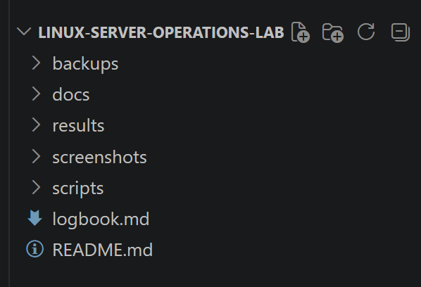
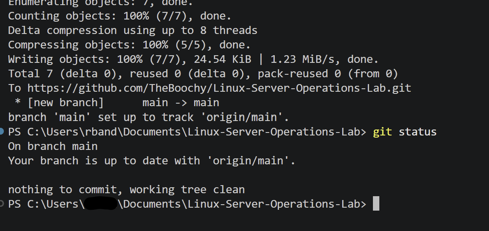
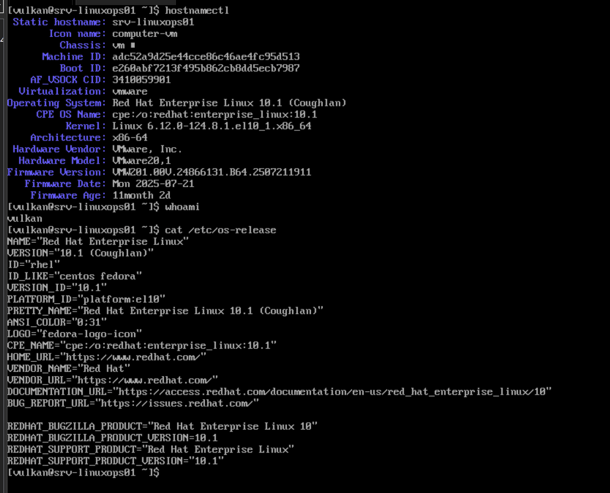
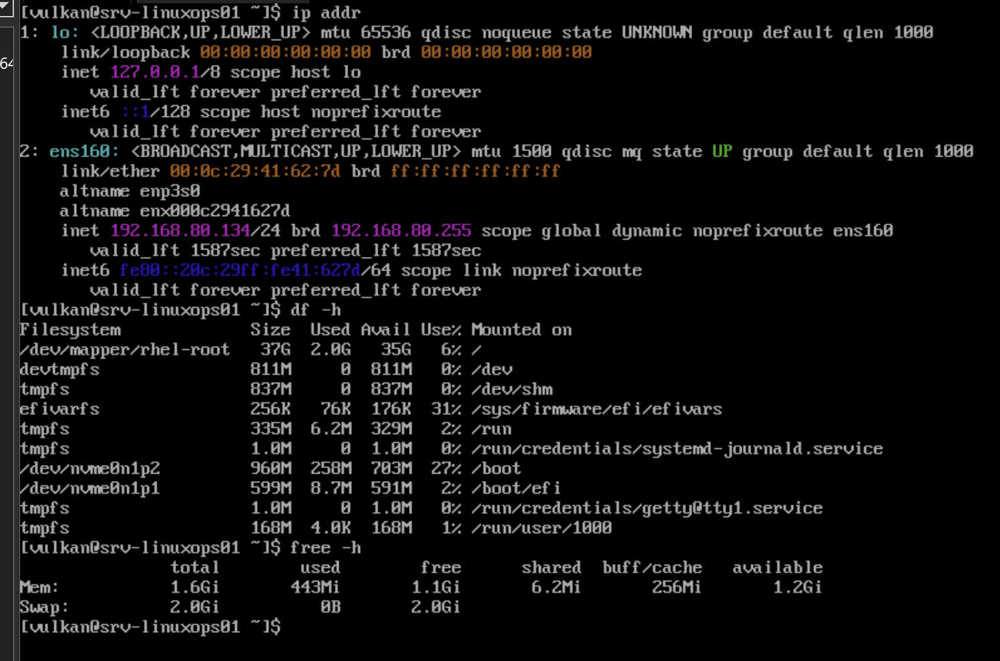
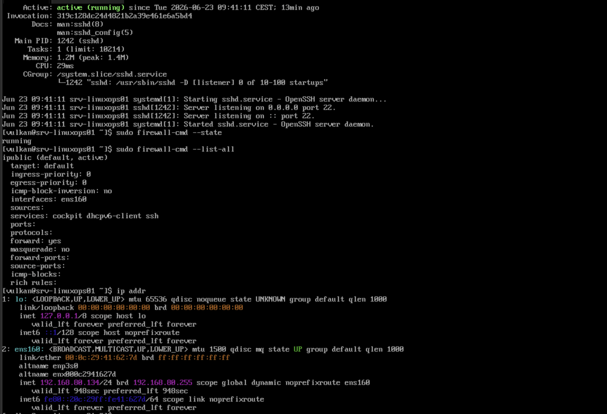
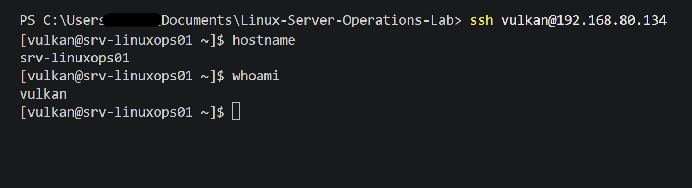
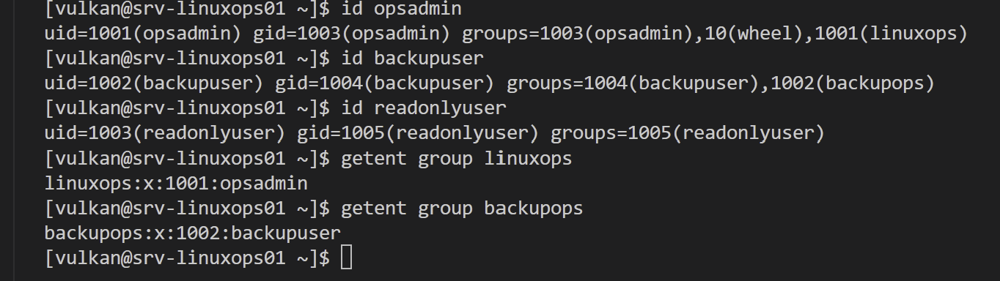
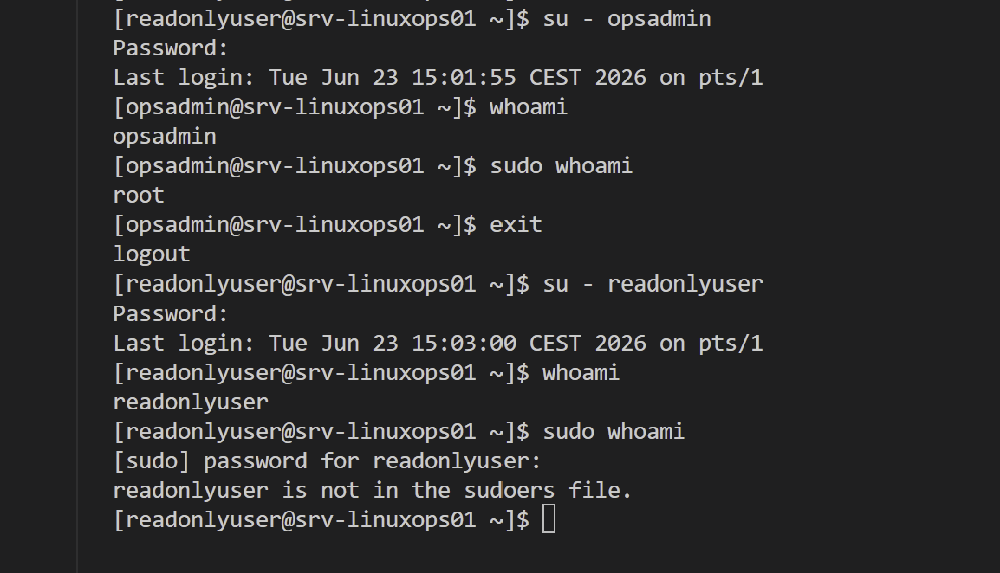
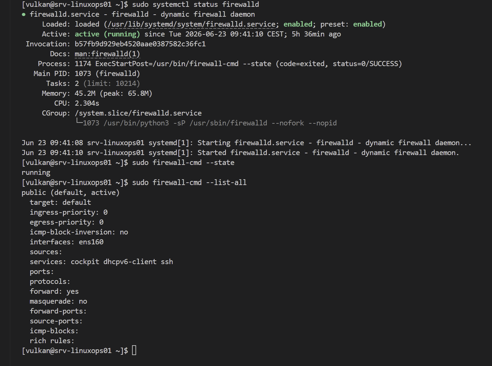
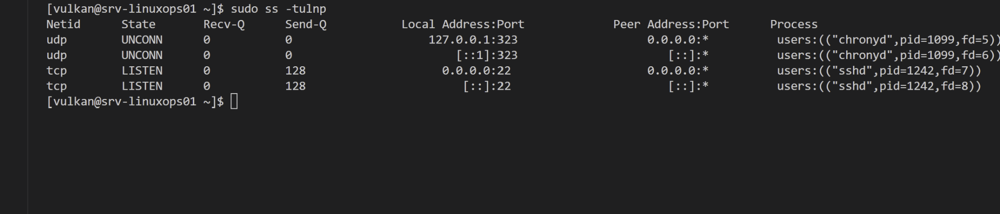

# Linux Server Operations Lab — Logbook

## 2026-06-23 — Part 1: Repository setup and planning

### Goal

Start the Linux Server Operations Lab by creating the local project structure, initial documentation files and Git repository.

### Work completed

* Created the local project folder.
* Created the main documentation folders:

  * docs
  * screenshots
  * scripts
  * results
  * backups
* Created README.md.
* Created logbook.md.
* Added initial project overview and planned lab parts.
* Prepared the project for the first Git commit.
* Initialized the local Git repository.
* Created the GitHub repository.
* Pushed the first project commit to GitHub.

### Notes

This lab will focus on practical Linux server operations and monitoring tasks.

The project is intended for a sysadmin portfolio and will be documented step by step with screenshots, command outputs and Git commits.

Public documentation will use the name Vulkan.

### Evidence

Screenshots:





---

## 2026-06-23 — Part 2: Linux server VM installation

### Goal

Install and verify the Linux operations server VM for the Linux Server Operations Lab.

### Work completed

* Created a VMware virtual machine named srv-linuxops01.
* Configured the VM with:

  * 2 CPU cores
  * 2048 MB RAM
  * 40 GB virtual disk
  * NAT networking
* Installed Red Hat Enterprise Linux 10.1 using Minimal Install.
* Configured the hostname as srv-linuxops01.
* Created the administrator user vulkan.
* Verified the installed operating system.
* Verified the active network interface and IP address.
* Verified disk usage.
* Verified memory and swap.
* Saved installation verification screenshots.

### Verification results

| Item                 | Result                        |
| -------------------- | ----------------------------- |
| Hostname             | srv-linuxops01                |
| User                 | vulkan                        |
| Operating system     | Red Hat Enterprise Linux 10.1 |
| Network interface    | ens160                        |
| IP address           | 192.168.80.134/24             |
| Root filesystem      | /dev/mapper/rhel-root         |
| Root filesystem size | 37 GB                         |
| Memory               | 1.6 GiB                       |
| Swap                 | 2.0 GiB                       |
| Virtualization       | VMware                        |

### Commands used

```bash
hostnamectl
whoami
cat /etc/os-release
ip addr
df -h
free -h
```

### Command purpose

| Command             | Purpose                                                                       |
| ------------------- | ----------------------------------------------------------------------------- |
| hostnamectl         | Shows the hostname, operating system, kernel and system identity information. |
| whoami              | Shows the currently logged-in user.                                           |
| cat /etc/os-release | Shows the installed Linux distribution and version.                           |
| ip addr             | Shows network interfaces and IP addresses.                                    |
| df -h               | Shows disk usage in human-readable format.                                    |
| free -h             | Shows memory and swap usage in human-readable format.                         |

### Notes

The server was installed using Minimal Install because this is closer to a real Linux server environment. A minimal server uses fewer resources and avoids unnecessary graphical software.

The VM received an IP address through VMware NAT networking. This will be used later when testing SSH administration from the Windows host.

### Evidence

Screenshots:





---

## 2026-06-23 — Part 3: Network and SSH administration

### Goal

Configure and verify SSH administration for the Linux operations server.

### Work completed

* Verified the active Linux network interface.
* Confirmed the server IP address.
* Checked the SSH daemon service.
* Verified that sshd is active and running.
* Verified that SSH is listening on port 22.
* Checked that firewalld is running.
* Verified that the firewall allows SSH traffic.
* Tested SSH login from Windows PowerShell.
* Confirmed remote administration access to srv-linuxops01.

### Verification results

| Item                     | Result            |
| ------------------------ | ----------------- |
| SSH service              | active running    |
| SSH daemon               | sshd              |
| SSH port                 | 22                |
| Firewall service         | firewalld         |
| Firewall state           | running           |
| Allowed firewall service | ssh               |
| Network interface        | ens160            |
| Server IP address        | 192.168.80.134/24 |
| Remote login user        | vulkan            |
| Remote login test        | Successful        |

### Commands used

```bash
systemctl status sshd
sudo firewall-cmd --state
sudo firewall-cmd --list-all
ip addr
```

```powershell
ssh vulkan@192.168.80.134
```

```bash
hostname
whoami
```

### Command purpose

| Command                      | Purpose                                                                   |
| ---------------------------- | ------------------------------------------------------------------------- |
| systemctl status sshd        | Checks whether the SSH server service is running.                         |
| sudo firewall-cmd --state    | Checks whether firewalld is running.                                      |
| sudo firewall-cmd --list-all | Shows active firewall zone settings and allowed services.                 |
| ip addr                      | Shows network interfaces and IP addresses.                                |
| ssh vulkan@192.168.80.134    | Starts a secure remote terminal session from Windows to the Linux server. |
| hostname                     | Confirms the connected system hostname.                                   |
| whoami                       | Confirms the logged-in Linux user.                                        |

### Notes

SSH is required for remote Linux administration. In a real server environment, administrators usually manage Linux systems remotely instead of using the local console.

The firewall allows SSH, which means the server can accept remote administration connections while still keeping firewall protection active.

Successful SSH login from Windows PowerShell confirms that the Linux server can be managed remotely.

### Evidence

Screenshots:





---

## 2026-06-23 — Part 4: Users, groups and sudo access

### Goal

Create Linux users and groups, assign group membership and verify sudo access behavior.

### Work completed

* Created the linuxops group.
* Created the backupops group.
* Created the opsadmin user.
* Created the backupuser user.
* Created the readonlyuser user.
* Set passwords for the created users.
* Added opsadmin to the linuxops group.
* Added backupuser to the backupops group.
* Added opsadmin to the wheel group for sudo access.
* Verified user and group membership.
* Tested sudo access for opsadmin.
* Verified that readonlyuser does not have sudo access.

### Verification results

| Item                          | Result                    |
| ----------------------------- | ------------------------- |
| Operations group              | linuxops                  |
| Backup group                  | backupops                 |
| Admin test user               | opsadmin                  |
| Backup test user              | backupuser                |
| Limited test user             | readonlyuser              |
| opsadmin group membership     | opsadmin, wheel, linuxops |
| backupuser group membership   | backupuser, backupops     |
| readonlyuser group membership | readonlyuser only         |
| opsadmin sudo test            | Successful                |
| readonlyuser sudo test        | Denied as expected        |

### Commands used

```bash
sudo groupadd linuxops
sudo groupadd backupops
sudo useradd -m -s /bin/bash opsadmin
sudo useradd -m -s /bin/bash backupuser
sudo useradd -m -s /bin/bash readonlyuser
sudo passwd opsadmin
sudo passwd backupuser
sudo passwd readonlyuser
sudo usermod -aG linuxops opsadmin
sudo usermod -aG backupops backupuser
sudo usermod -aG wheel opsadmin
id opsadmin
id backupuser
id readonlyuser
getent group linuxops
getent group backupops
su - opsadmin
whoami
sudo whoami
exit
su - readonlyuser
whoami
sudo whoami
```

### Command purpose

| Command                                   | Purpose                                                                 |
| ----------------------------------------- | ----------------------------------------------------------------------- |
| sudo groupadd linuxops                    | Creates the linuxops group.                                             |
| sudo groupadd backupops                   | Creates the backupops group.                                            |
| sudo useradd -m -s /bin/bash opsadmin     | Creates opsadmin with a home directory and Bash shell.                  |
| sudo useradd -m -s /bin/bash backupuser   | Creates backupuser with a home directory and Bash shell.                |
| sudo useradd -m -s /bin/bash readonlyuser | Creates readonlyuser with a home directory and Bash shell.              |
| sudo passwd username                      | Sets a password for the selected user.                                  |
| sudo usermod -aG group user               | Adds an existing user to an additional group.                           |
| id username                               | Shows user ID and group membership.                                     |
| getent group groupname                    | Shows information about a specific group.                               |
| su - username                             | Switches to another user and loads that user environment.               |
| whoami                                    | Shows the currently active user.                                        |
| sudo whoami                               | Tests whether the user can run a command with administrator privileges. |
| exit                                      | Leaves the current user session and returns to the previous session.    |

### Notes

The opsadmin user was added to the wheel group, which allows sudo access on RHEL-based systems.

The readonlyuser account was intentionally left without sudo access. This confirms that limited users cannot perform administrator actions.

This part demonstrates basic Linux identity and access management, including user creation, group membership and privilege testing.

### Evidence

Screenshots:





---

## 2026-06-23 — Part 5: Firewall and basic hardening

### Goal

Verify the Linux firewall configuration and review listening network services for basic hardening.

### Work completed

* Checked the firewalld service status.
* Verified that firewalld is active and running.
* Confirmed that firewalld is enabled at boot.
* Checked the current firewall state.
* Listed the active firewall zone configuration.
* Verified that SSH is allowed through the firewall.
* Reviewed listening TCP and UDP services.
* Confirmed that SSH is the only externally listening remote administration service.
* Confirmed that chronyd is only listening locally for time synchronization.
* Verified that Cockpit is allowed in the firewall but not actively listening on port 9090.

### Verification results

| Item                             | Result                                            |
| -------------------------------- | ------------------------------------------------- |
| Firewall service                 | firewalld                                         |
| Firewall status                  | active running                                    |
| Firewall boot state              | enabled                                           |
| Firewall state                   | running                                           |
| Active zone                      | public                                            |
| Active interface                 | ens160                                            |
| Allowed services                 | cockpit, dhcpv6-client, ssh                       |
| Externally listening TCP service | sshd on port 22                                   |
| Local UDP service                | chronyd on port 323                               |
| Cockpit listening on port 9090   | No                                                |
| Hardening result                 | No unexpected externally listening services found |

### Commands used

```bash
sudo systemctl status firewalld
sudo firewall-cmd --state
sudo firewall-cmd --list-all
sudo ss -tulpn
```

### Command purpose

| Command                         | Purpose                                                                                                          |
| ------------------------------- | ---------------------------------------------------------------------------------------------------------------- |
| sudo systemctl status firewalld | Checks whether the firewall service is running and enabled.                                                      |
| sudo firewall-cmd --state       | Shows whether firewalld is currently running.                                                                    |
| sudo firewall-cmd --list-all    | Lists the active firewall zone, interface and allowed services.                                                  |
| sudo ss -tulpn                  | Shows TCP and UDP services that are listening for network connections, including process names and port numbers. |

### Notes

The firewall is active and allows SSH, which is required for remote administration.

The firewall also lists Cockpit as an allowed service, but the listening services check did not show Cockpit listening on port 9090. This means Cockpit was allowed by the firewall but was not actively exposed as a running web administration service.

The listening services check showed sshd listening on port 22 and chronyd listening locally on port 323. No unexpected externally listening services were found.

This part demonstrates basic Linux firewall review and service exposure checking.

### Evidence

Screenshots:




